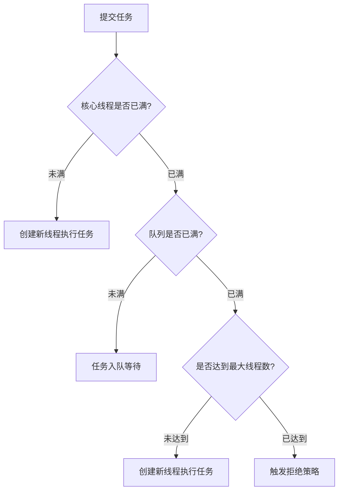

## **面试官**：谈谈你对乐观锁、悲观锁、分布式锁、读写锁的理解。

候选人：

好的，这些锁机制是解决并发问题的核心手段，各自适用于不同的场景。我来分别阐述它们的原理、应用及实践经验。

---

### **一、乐观锁（Optimistic Lock）**
**核心思想**：假设并发冲突的概率低，只在提交时检测数据是否被修改。  
**实现方式**：  
1. **版本号机制**：数据表中增加版本号字段，更新时校验版本号。  
   ```sql
   UPDATE table SET value = new_value, version = version + 1 
   WHERE id = #{id} AND version = #{old_version}
   ```
2. **CAS（Compare And Swap）**：通过CPU原子指令实现无锁并发。  
   ```java
   AtomicInteger count = new AtomicInteger(0);
   count.compareAndSet(0, 1); // 当前值为0时更新为1
   ```

**适用场景**：  
- 读多写少，冲突概率低（如点赞计数、库存扣减）。  
- 需要高并发吞吐（避免锁竞争开销）。  

**优点**：无锁设计，性能高。  
**缺点**：  
- **ABA问题**：数据被修改后恢复原值，导致CAS误判（可通过时间戳或递增版本号解决）。  
- **自旋开销**：高冲突场景下频繁重试。  

**案例**：  
电商系统中，秒杀活动库存扣减使用Redis的`WATCH`+`MULTI`实现乐观锁，确保超卖问题。

---

### **二、悲观锁（Pessimistic Lock）**
**核心思想**：假设并发冲突概率高，操作前先加锁独占资源。  
**实现方式**：  
1. **数据库行锁**：`SELECT ... FOR UPDATE`。  
2. **Java锁机制**：`synchronized`、`ReentrantLock`。  

**适用场景**：  
- 写多读少，冲突概率高（如账户转账、订单支付）。  
- 需要强一致性保证。  

**优点**：保证数据强一致性。  
**缺点**：锁竞争导致吞吐下降，可能引发死锁。  

**案例**：  
银行转账时，使用数据库事务+行级锁，确保转账操作的原子性。

---

### **三、分布式锁（Distributed Lock）**
**核心思想**：在分布式系统中协调多节点对共享资源的互斥访问。  
**实现方式**：  
1. **Redis（AP模型）**：  
   ```java
   // Redisson实现
   RLock lock = redisson.getLock("order_lock");
   lock.lock(30, TimeUnit.SECONDS); // 支持自动续期
   try {
       // 业务逻辑
   } finally {
       lock.unlock();
   }
   ```
   - **缺点**：主从切换可能导致锁失效（需RedLock算法，但仍有争议）。  

2. **ZooKeeper（CP模型）**：  
   - 基于临时顺序节点，通过Watcher机制实现锁竞争。  
   - 优点：强一致，无脑裂问题。  
   - 缺点：性能低于Redis，需维护长连接。  

**适用场景**：  
- 分布式系统资源互斥（如定时任务调度、分布式事务协调）。  

**关键问题**：  
- **锁续期**：需实现心跳机制防止业务未完成锁超时（如Redisson的`WatchDog`）。  
- **容错性**：确保锁在节点宕机时自动释放。  

**案例**：  
分布式系统中，使用ZooKeeper实现全局唯一ID生成服务的互斥锁。

---

### **四、读写锁（ReadWrite Lock）**
**核心思想**：读共享，写独占，提升读多写少场景的并发度。  
**实现方式**：  
```java
ReentrantReadWriteLock rwLock = new ReentrantReadWriteLock();
Lock readLock = rwLock.readLock(); // 读锁（共享）
Lock writeLock = rwLock.writeLock(); // 写锁（独占）

// 读操作
readLock.lock();
try {
    // 读取数据
} finally {
    readLock.unlock();
}

// 写操作
writeLock.lock();
try {
    // 修改数据
} finally {
    writeLock.unlock();
}
```

**适用场景**：  
- 读操作远多于写操作（如配置中心、缓存数据）。  
- 需要保证写操作的原子性，同时允许多读并发。  

**优点**：显著提升读性能。  
**缺点**：  
- **写饥饿**：持续读操作可能导致写线程长期等待（可设置公平锁缓解）。  
- **锁降级**：写锁可降级为读锁，但读锁无法升级为写锁。  

**案例**：  
缓存系统中，使用`StampedLock`的乐观读（`tryOptimisticRead`）进一步减少锁竞争。

---

### **五、锁机制对比与选型**
| **锁类型**     | **适用场景**               | **性能** | **一致性** | **复杂度** |  
|----------------|--------------------------|---------|-----------|-----------|  
| **乐观锁**     | 低冲突、高并发读           | 高       | 最终      | 低        |  
| **悲观锁**     | 高冲突、强一致性           | 中       | 强        | 中        |  
| **分布式锁**   | 跨进程资源协调             | 低       | 依赖实现  | 高        |  
| **读写锁**     | 读多写少                  | 高       | 强        | 中        |  

---

### **六、实践经验总结**
1. **减少锁粒度**：  
   - 使用`ConcurrentHashMap`的分段锁替代全局锁。  
   - 数据库对非必要字段不加锁。  

2. **避免死锁**：  
   - 按固定顺序获取锁。  
   - 使用`tryLock`设置超时。  

3. **监控与调优**：  
   - 通过JMX监控锁竞争（如`ReentrantLock`的`getQueueLength`）。  
   - 压测验证锁性能（如使用JMeter模拟高并发）。  

4. **分布式锁容灾**：  
   - 为Redis锁设置合理的超时时间，并实现续期逻辑。  
   - ZooKeeper锁需处理Session过期（如`Curator`的`InterProcessMutex`）。  

**案例**：  
某交易平台在促销活动中，针对商品详情页的读多写少场景，采用`ReentrantReadWriteLock`，将QPS从1.2万提升至4.8万，同时保证价格库存的强一致性。

---

**总结**：  
- **乐观锁**和**悲观锁**是解决并发问题的两种哲学，前者信任环境，后者防范风险。  
- **分布式锁**是分布式系统的刚需，需在CAP中权衡选择Redis或ZooKeeper。  
- **读写锁**通过分离读/写操作最大化并发效率。  
- 实际开发中需结合业务特点（冲突频率、一致性要求、吞吐需求）选择最合适的锁机制。


## **面试官**：谈谈你对线程守护的理解。

**候选人**：

好的，守护线程（DaThread）是Java中一种特殊类型的线程，它的核心作用是为其他线程（用户线程）提供后台服务支持。当所有用户线程结束时，守护线程会自动终止，无论其任务是否完成。以下是我对守护线程的理解和实际应用中的注意事项：

---

### **一、守护线程的核心特性**
1. **自动终止机制**  
   当JVM中仅剩守护线程运行时，JVM会直接退出，不会等待守护线程完成任务。  
   **示例**：  
   ```java
   Thread daemonThread = new Thread(() -> {
       while (true) {
           System.out.println("守护线程运行中...");
           try { Thread.sleep(1000); } 
           catch (InterruptedException e) { e.printStackTrace(); }
       }
   });
   daemonThread.setDaemon(true); // 必须在线程启动前设置
   daemonThread.start();
   
   // 主线程结束 → 所有用户线程终止 → 守护线程自动退出
   ```

2. **非阻塞性**  
   守护线程的存在不会阻止JVM退出，适合执行非关键性任务（如日志轮转、监控等）。

3. **继承性**  
   由守护线程创建的线程默认也是守护线程。

---

### **二、典型应用场景**
| 场景                | 说明                                                                 |
|---------------------|--------------------------------------------------------------------|
| **垃圾回收（GC）**   | JVM的垃圾回收线程是守护线程，负责自动内存管理                          |
| **心跳检测**         | 网络服务中定期发送心跳包检测连接状态                                   |
| **缓存清理**         | 周期性清理过期缓存条目                                                 |
| **日志异步写入**     | 将日志写入操作委托给守护线程，避免阻塞主线程（需确保写入完整性）          |

---

### **三、使用注意事项**
1. **设置时机**  
   必须在调用`start()`方法前设置`setDaemon(true)`，否则抛出`IllegalThreadStateException`。

2. **资源管理风险**  
   守护线程中不要执行关键任务（如数据库事务提交、文件持久化），否则可能因JVM退出导致数据丢失。  
   **反例**：  
   ```java
   daemonThread = new Thread(() -> {
       try {
           writeToFile(); // 可能未完成写入即被终止
       } finally {
           // finally块可能无法执行
       }
   });
   ```

3. **线程池中的守护线程**  
   通过`ThreadFactory`自定义线程池中的线程为守护线程：  
   ```java
   ExecutorService executor = Executors.newCachedThreadPool(r -> {
       Thread t = new Thread(r);
       t.setDaemon(true);
       return t;
   });
   ```

4. **避免依赖守护线程执行清理**  
   需要显式释放资源（如关闭网络连接）时，应使用用户线程结合`shutdownHook`。

---

### **四、守护线程 vs 用户线程**
| 特性                | 守护线程                          | 用户线程                          |
|---------------------|---------------------------------|---------------------------------|
| **JVM退出影响**      | 立即终止                         | 必须等待执行完毕                  |
| **默认类型**         | 否（需显式设置）                  | 是（主线程默认是用户线程）          |
| **适用场景**         | 辅助性任务                       | 核心业务逻辑                      |
| **资源依赖**         | 避免持有需释放的资源               | 需确保资源正确释放                |

---

### **五、实战避坑指南**
1. **避免在守护线程中执行I/O操作**  
   若必须执行，需增加同步屏障确保任务完成：  
   ```java
   CountDownLatch latch = new CountDownLatch(1);
   daemonThread = new Thread(() -> {
       writeToFile();
       latch.countDown();
   });
   daemonThread.setDaemon(true);
   daemonThread.start();
   latch.await(); // 主线程等待守护线程完成
   ```

2. **监控守护线程状态**  
   通过JMX或自定义监控逻辑检测守护线程是否存活：  
   ```java
   if (!daemonThread.isAlive()) {
       log.error("守护线程异常终止");
   }
   ```

3. **与ShutdownHook结合**  
   在JVM关闭时执行必要的清理操作：  
   ```java
   Runtime.getRuntime().addShutdownHook(new Thread(() -> {
       // 释放资源
   }));
   ```

---

**总结**：  
守护线程是Java多线程编程中重要的后台支持机制，但需谨慎使用。它适用于非关键性任务，如监控、日志等，但需避免依赖其执行资源敏感型操作。正确理解其生命周期和限制，能够有效提升程序的健壮性。例如，在分布式系统中，我们曾用守护线程实现服务注册中心的健康检查，确保在主服务线程异常退出时，守护线程能快速终止，避免僵尸进程。


##  **线程池与线程安全容器详解**

#### **一、线程池的核心概念与实现**
线程池是一种**线程资源复用机制**，通过预先创建并管理线程，降低频繁创建和销毁线程的开销，提升系统性能和稳定性。

##### **1. 线程池关键参数**
- **核心线程数（corePoolSize）**：线程池长期维持的线程数量，即使空闲也不会回收。
- **最大线程数（maximumPoolSize）**：线程池允许创建的最大线程数。
- **任务队列（workQueue）**：用于缓存待执行任务的阻塞队列。
- **拒绝策略（RejectedExecutionHandler）**：当任务数超过最大处理能力时的处理策略。

##### **2. 线程池工作流程**


##### **3. 常见线程池类型**
| 类型                  | 特点                                                                 | 适用场景                     |
|-----------------------|--------------------------------------------------------------------|----------------------------|
| **FixedThreadPool**   | 固定线程数，使用无界队列（LinkedBlockingQueue）                          | 长期稳定的并发任务              |
| **CachedThreadPool**  | 线程数无上限，空闲线程60秒回收，使用同步队列（SynchronousQueue）            | 短时异步任务，高并发但需防资源耗尽   |
| **ScheduledThreadPool** | 支持定时或周期性任务，使用DelayedWorkQueue                              | 定时任务、心跳检测               |
| **SingleThreadExecutor** | 单线程执行，保证任务顺序性                                              | 需顺序执行的任务（如日志处理）      |

##### **4. 拒绝策略**
- **AbortPolicy**（默认）：抛出RejectedExecutionException。
- **CallerRunsPolicy**：由提交任务的线程直接执行任务。
- **DiscardPolicy**：静默丢弃任务。
- **DiscardOldestPolicy**：丢弃队列中最旧的任务，重试提交。

**示例代码**：
```java
ThreadPoolExecutor executor = new ThreadPoolExecutor(
    4, // corePoolSize
    8, // maximumPoolSize
    60, TimeUnit.SECONDS, // keepAliveTime
    new ArrayBlockingQueue<>(100), // 有界队列
    new ThreadPoolExecutor.CallerRunsPolicy() // 拒绝策略
);
```

---

#### **二、线程安全容器**
线程安全容器通过**内部同步机制**保证多线程环境下的数据一致性，常见实现类位于`java.util.concurrent`包。

##### **1. 常见线程安全容器**
| 容器                  | 实现原理                              | 适用场景                     |
|-----------------------|-------------------------------------|----------------------------|
| **ConcurrentHashMap** | 分段锁（JDK7）或 CAS + synchronized（JDK8） | 高并发读写，如缓存、计数器          |
| **CopyOnWriteArrayList** | 写时复制（复制整个数组）                  | 读多写少场景（如监听器列表）        |
| **BlockingQueue**      | 锁 + Condition实现阻塞操作              | 生产者-消费者模型（如任务队列）      |
| **ConcurrentLinkedQueue** | CAS实现的无锁队列                       | 高吞吐量无阻塞队列               |

##### **2. 核心实现对比**
- **ConcurrentHashMap**  
  JDK8后采用`Node + CAS + synchronized`，锁粒度细化到链表头节点，并发度更高。
  ```java
  ConcurrentHashMap<String, Integer> map = new ConcurrentHashMap<>();
  map.computeIfAbsent("key", k -> 1); // 原子操作
  ```

- **CopyOnWriteArrayList**  
  写操作通过复制数组实现线程安全，读操作无锁。适合遍历频繁但修改少的场景。
  ```java
  CopyOnWriteArrayList<String> list = new CopyOnWriteArrayList<>();
  list.add("item"); // 加锁复制数组
  ```

- **BlockingQueue**  
  如`ArrayBlockingQueue`（有界）和`LinkedBlockingQueue`（可选有界/无界），支持阻塞插入/取出。
  ```java
  BlockingQueue<Runnable> queue = new ArrayBlockingQueue<>(100);
  queue.put(task); // 阻塞直到队列有空位
  Runnable task = queue.take(); // 阻塞直到队列有元素
  ```

##### **3. 使用场景与选型**
- **高并发计数器**：使用`ConcurrentHashMap`的`compute`方法。
- **缓存系统**：`ConcurrentHashMap` + 软引用/弱引用。
- **任务调度**：`ThreadPoolExecutor` + `BlockingQueue`。
- **事件监听器**：`CopyOnWriteArrayList`避免遍历时修改导致的异常。

---

#### **三、实战经验与避坑指南**
##### **1. 线程池常见问题**
- **资源耗尽**：无界队列（如LinkedBlockingQueue）可能导致OOM。
  - **解决方案**：使用有界队列并合理设置拒绝策略。
- **死锁**：任务相互等待导致线程饥饿。
  - **示例**：线程池大小为2，两个任务各自提交子任务并等待结果。
  - **解决**：避免在任务中提交阻塞性子任务，或使用`ForkJoinPool`。

##### **2. 线程安全容器注意事项**
- **ConcurrentHashMap的弱一致性**：迭代器不保证反映最新修改。
  ```java
  ConcurrentHashMap<String, String> map = new ConcurrentHashMap<>();
  map.put("a", "1");
  Iterator<String> it = map.values().iterator();
  map.put("b", "2"); 
  // 迭代器可能不包含"b"
  ```
- **CopyOnWriteArrayList的内存开销**：频繁写操作会导致数组频繁复制，适合读多写少场景。

##### **3. 性能优化**
- **线程池监控**：通过`ThreadPoolExecutor`的`getActiveCount()`、`getQueue().size()`等指标实时监控。
- **容器选择**：读多写少用`ConcurrentHashMap`，写多用`Collections.synchronizedMap()`（需外部同步）。
- **避免锁竞争**：使用`LongAdder`替代`AtomicLong`（高并发计数器场景）。

---

#### **四、总结**
- **线程池**是管理线程生命周期的核心工具，需根据任务类型（CPU密集型、IO密集型）合理配置参数。
- **线程安全容器**通过精细的锁机制或无锁编程实现高效并发，需根据读写比例和性能需求选择。
- **实际应用**中，线程池需配合有界队列和拒绝策略防止资源耗尽，线程安全容器需注意迭代器弱一致性和内存开销。

通过合理使用线程池和线程安全容器，可显著提升高并发系统的吞吐量和稳定性。例如，某电商系统通过`ThreadPoolExecutor`管理订单处理线程，结合`ConcurrentHashMap`缓存商品信息，成功支撑了双十一期间每秒数万次的并发请求。


## **面试官**：谈谈你对线程安全的理解，以及信号量、Lock、synchronized的使用概念？

**候选人**：

好的，我来分享一下我对线程安全和这些同步机制的理解。

---

### **1. 线程安全的核心问题**
线程安全的核心是确保多个线程并发访问共享资源时，程序的执行结果始终符合预期。这需要解决三个关键问题：
- **原子性**：操作不可分割（如 `i++` 需要保证“读取-修改-写入”的原子性）。
- **可见性**：一个线程对共享变量的修改对其他线程立即可见。
- **有序性**：禁止指令重排序导致逻辑错误。

---

### **2. synchronized：内置锁**
**特点**：
- **语法简单**：直接修饰方法或代码块，自动加锁/解锁。
- **基于Monitor机制**：每个对象关联一个监视器锁，通过字节码指令 `monitorenter` 和 `monitorexit` 实现。
- **非公平锁**：等待线程无法按申请顺序获取锁。
- **可重入性**：同一线程可重复获取同一把锁（避免死锁）。

**使用场景**：
- 简单的临界区保护（如单例模式的懒加载）。
- 对性能要求不高且同步逻辑不复杂的场景。

**示例**：
```java
public class Counter {
    private int count;
    
    public synchronized void increment() {
        count++; // 保证原子性
    }
}
```

**缺点**：
- 无法中断等待锁的线程。
- 无法设置超时。
- 粒度较粗（只能锁整个方法或对象）。

---

### **3. Lock接口：灵活控制**
**核心实现（如ReentrantLock）**：
- **显式锁**：需要手动调用 `lock()` 和 `unlock()`（通常在 `finally` 中释放）。
- **可中断**：通过 `lockInterruptibly()` 响应中断。
- **超时机制**：`tryLock(long timeout, TimeUnit unit)` 避免死等。
- **公平性**：支持公平锁（按申请顺序获取）和非公平锁。
- **条件变量**：通过 `Condition` 实现线程间精确唤醒（如生产者-消费者模型）。

**使用场景**：
- 需要灵活控制锁的获取与释放。
- 需要实现复杂同步逻辑（如超时、可中断）。
- 需要公平性保证的高并发场景。

**示例**：
```java
Lock lock = new ReentrantLock();
public void transfer(Account from, Account to, int amount) {
    lock.lock();
    try {
        // 转账逻辑
    } finally {
        lock.unlock();
    }
}
```

**优势**：
- 更细粒度的控制。
- 支持多条件变量，提升并发效率。

---

### **4. 信号量（Semaphore）：资源管控**
**核心思想**：
- 通过“许可证”机制控制并发线程数。
- 初始化时指定许可证数量，线程获取许可证后执行，执行完毕释放。

**使用场景**：
- 限流（如接口每秒最多处理100个请求）。
- 资源池管理（如数据库连接池）。
- 控制同时访问特定资源的线程数。

**示例**：
```java
Semaphore semaphore = new Semaphore(10); // 允许10个线程并发

public void accessResource() {
    semaphore.acquire(); // 获取许可
    try {
        // 使用资源
    } finally {
        semaphore.release(); // 释放许可
    }
}
```

**特性**：
- 支持公平/非公平模式。
- 可动态调整许可证数量（如 `semaphore.release(5)`）。

---

### **5. 对比与选型**
| **机制**        | **适用场景**                     | **优势**                      | **局限性**                     |
|-----------------|--------------------------------|------------------------------|-------------------------------|
| **synchronized** | 简单同步、单JVM内互斥            | 自动管理、无需手动释放         | 功能单一、无法中断或超时        |
| **Lock**         | 复杂锁逻辑、需要细粒度控制         | 灵活、支持条件变量和超时        | 需手动管理、易遗漏释放          |
| **Semaphore**    | 资源并发数限制、流量控制           | 灵活控制并发度                 | 不保证资源操作的原子性          |

---

### **6. 实战经验与避坑指南**
1. **锁粒度控制**：
   - 粗粒度锁（如锁整个方法）可能导致性能瓶颈。
   - 细粒度锁（如分段锁）提升并发能力，但复杂度高。

2. **死锁预防**：
   - 避免嵌套锁（如线程A持有锁1请求锁2，线程B持有锁2请求锁1）。
   - 使用 `tryLock` 设置超时，打破死锁等待。

3. **性能优化**：
   - 读多写少场景使用 `ReadWriteLock`（如缓存）。
   - 无竞争时，`synchronized` 经过JVM优化（偏向锁、轻量级锁）性能优于 `Lock`。

---

**总结**：  
- **synchronized** 适合简单场景，开发成本低；  
- **Lock** 提供更灵活的并发控制，适合复杂逻辑；  
- **Semaphore** 用于资源管控而非互斥。实际选型需结合具体场景，在高并发系统中，通常会组合使用多种机制（如 `synchronized` + `ConcurrentHashMap` + `Semaphore`）实现最优效果。